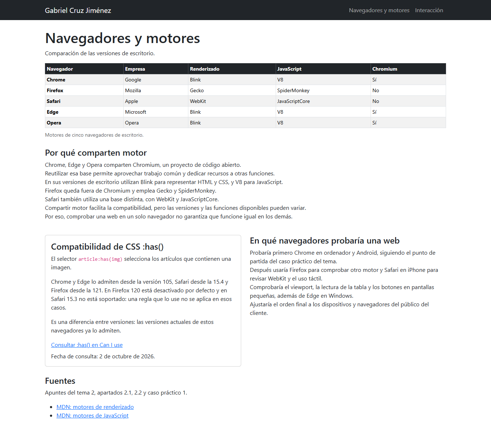
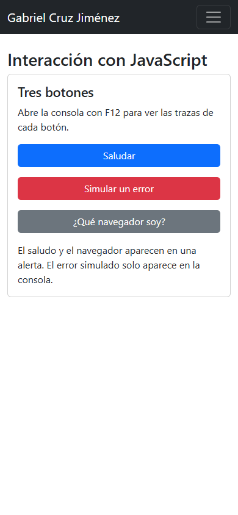

# Tema 2 · Navegadores y primera página interactiva

**Gabriel Cruz Jiménez · Desarrollo Web en Entorno Cliente**

## Sitio y pruebas

La web tiene dos páginas. En `index.html` se comparan cinco navegadores y sus motores, con un ejemplo de compatibilidad de CSS `:has()`. En `interaccion.html` están los tres botones: saludar, simular un error y mostrar el navegador.

Las dos páginas usan la plantilla de Bootstrap, comparten el menú y se adaptan al móvil. El JavaScript está en `js/app.js`.

Las pruebas automáticas con Chrome y Firefox comprobaron que los botones funcionan y que no hay errores al cargar ni desplazamiento horizontal en los tamaños probados. El error de consola solo aparece al pulsar «Simular un error».

## Evidencias



Vista de escritorio con la tabla y mi nombre en el menú.



Vista de los tres botones con un ancho de 390 píxeles.

Estas capturas se obtuvieron automáticamente en este equipo. Faltan las capturas manuales del modo móvil de F12, la consola, las alertas en ambos navegadores y VS Code con Live Server.

## Quién hace qué

En «Saludar», HTML crea el botón y llama a `saludar()` al pulsarlo. Bootstrap le da su aspecto y JavaScript muestra el saludo con `alert()` y deja una traza con `console.log()`. La alerta la ve el usuario; la traza se consulta en la consola.

## Comparación de userAgent

Valores recogidos en las pruebas automáticas:

**Chrome**

```text
Mozilla/5.0 (Windows NT 10.0; Win64; x64) AppleWebKit/537.36 (KHTML, like Gecko) HeadlessChrome/154.0.0.0 Safari/537.36
```

**Firefox**

```text
Mozilla/5.0 (Windows NT 10.0; Win64; x64; rv:153.0) Gecko/20100101 Firefox/153.0
```

Ambos indican Windows de 64 bits. Firefox incluye `Gecko` y Chrome aparece como `HeadlessChrome` porque la prueba se hizo sin ventana. Palabras como `Mozilla`, `AppleWebKit` o `Safari` se mantienen por compatibilidad y no significan que todos usen el mismo motor.

## Fuentes consultadas

Consulta: 2 de octubre de 2026.

- Apuntes de los temas 1 y 2.
- [Plantilla de la asignatura](https://github.com/DRodero/DWEC_2627/blob/main/plantilla/plantilla-base.html).
- [MDN: motores de renderizado](https://developer.mozilla.org/en-US/docs/Glossary/Engine/Rendering).
- [MDN: motores de JavaScript](https://developer.mozilla.org/en-US/docs/Glossary/Engine/JavaScript).
- [Can I use: CSS :has()](https://caniuse.com/css-has).
- [MDN: userAgent](https://developer.mozilla.org/en-US/docs/Web/HTTP/Guides/Browser_detection_using_the_user_agent).

## Uso de IA

Este README ha sido creado por ChatGPT.
