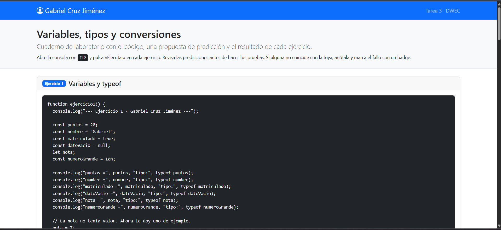
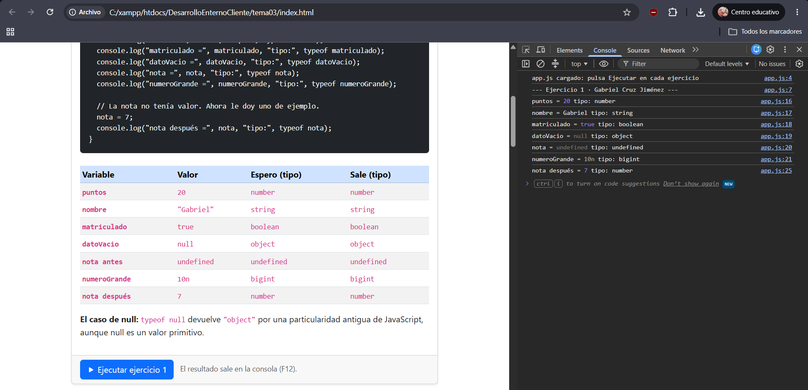
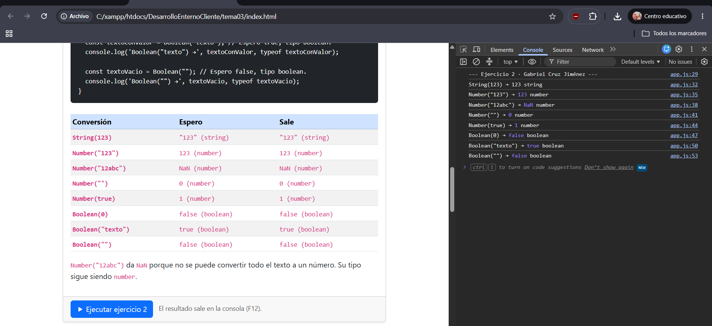
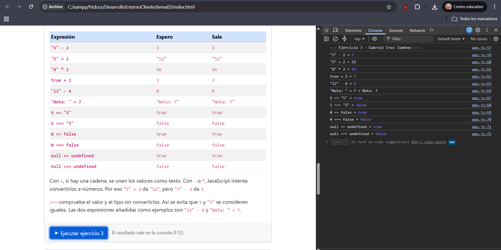
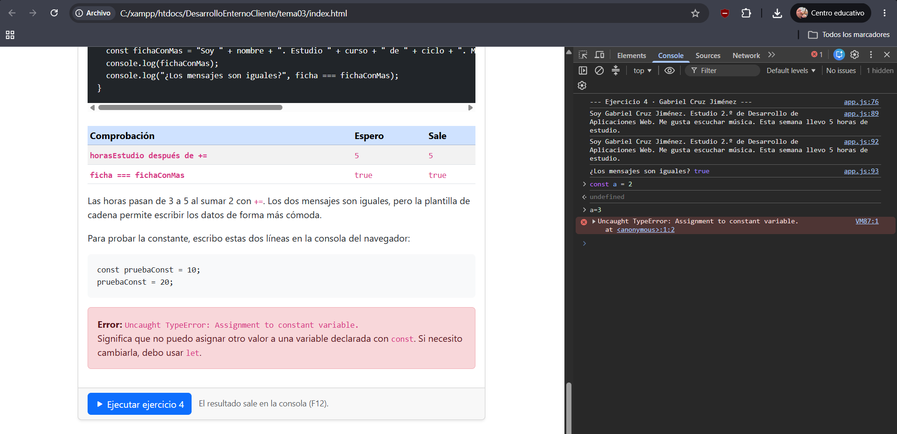

# Tarea 3 · Variables, tipos y conversiones

**Autor:** Gabriel Cruz Jiménez · Desarrollo Web en Entorno Cliente · 2.º DAW · Curso 2026-27

Esta carpeta contiene cuatro ejercicios sobre variables, conversiones, comparaciones y plantillas de cadena. Para probarlos, abro `index.html`, pulso F12 y entro en la consola. Cada botón ejecuta un ejercicio. El cuarto también muestra una ventana con la ficha.

## Capturas

### a) La página entera

Se ven el nombre, los cuatro ejercicios, el código y las tablas.

### b) Consola del ejercicio 1

Se muestran los seis tipos y el cambio de la nota: primero vale `undefined` y después vale 7.

### c) Consola del ejercicio 2

Aparecen las ocho conversiones con su tipo. `Number("12abc")` da `NaN` y `Number("")` da 0.

### d) Consola del ejercicio 3

Se ven las seis expresiones y las comparaciones. `==` puede convertir los valores; `===` también comprueba el tipo.

### e) Consola del ejercicio 4

Los dos mensajes coinciden. Al intentar cambiar `pruebaConst` desde la consola aparece el error de asignación a una constante.

## Reflexión

Convertir `"123"` a 123 es sencillo porque el texto contiene un número.  
Con `"12abc"` no ocurre lo mismo: el resultado es `NaN`.  
Un caso menos evidente es `Number("")`, que devuelve 0.  
`Boolean("texto")` da true porque la cadena no está vacía.  
También hay que fijarse en el operador: `"5" + 2` une texto, pero `"5" - 2` resta.  
Usar `===` ayuda a distinguir un número de una cadena con ese mismo número.

## Fuentes

- Apuntes facilitados de los temas 1, 2 y 3 de Desarrollo Web en Entorno Cliente y enunciado de la tarea 3, disponibles en el campus.
- [Plantilla del profesor](https://github.com/DRodero/DWEC_2627/tree/main/tema03_plantilla).

## Uso de IA

He pedido ayuda a ChatGPT para preparar el README.md
